# Data Driven Dojô ⚔️📊

Uma plataforma gamificada para formação de profissionais de dados, construída com React, TypeScript, Vite e Django REST.

## Visão Geral

O Data Driven Dojô combina gamificação, trilhas de aprendizado e um workspace interativo para acelerar a jornada de profissionais de dados. O sistema atual permite cadastrar cursos, módulos, aulas, vídeos e exercícios, além de oferecer um ambiente de desafio com editor SQL e feedback visual.

## Tecnologias

- Frontend: React + TypeScript + Vite
- Roteamento: TanStack Router
- Estado e dados: TanStack React Query
- Estilização: Tailwind CSS
- Notificações: Sonner
- Gráficos: Recharts
- Backend: Django 6 + Django REST Framework
- Autenticação: dj-rest-auth + token auth
- Data store: PostgreSQL (opcional SQLite em dev)
- Filas: Celery + Redis

## Estrutura do Repositório

- [src](src) — frontend React
  - [src/routes](src/routes) — páginas do app
  - [src/components](src/components) — componentes reutilizáveis
  - [src/lib](src/lib) — estado do Dojô e helpers
- [apps/api](apps/api) — backend Django
  - [apps/api/core](apps/api/core) — modelos, serializers, views e rotas
  - [apps/api/config](apps/api/config) — configuração do Django
- [apps/api/requirements.txt](apps/api/requirements.txt) — dependências Python
- [package.json](package.json) — dependências e scripts do frontend

## Funcionalidades Principais

- Cadastro e login de usuários
- Dashboard de progresso com gráficos de XP, horas e streak
- Workspace de desafio com editor SQL simulado
- Feed de comunidade com posts, curtidas e comentários falsos
- Persistência local do estado do usuário no navegador
- Integração com backend Django para cursos, módulos, aulas, vídeos e exercícios
- Suporte a exercícios estruturados com enunciado, tipo, resposta esperada e critérios de avaliação

## Arquitetura e Diagramas

A documentação abaixo descreve a arquitetura atual do sistema com foco em estrutura, fluxo de dados, comportamento e modelagem.

### 1. Diagrama estrutural / arquitetura de alto nível

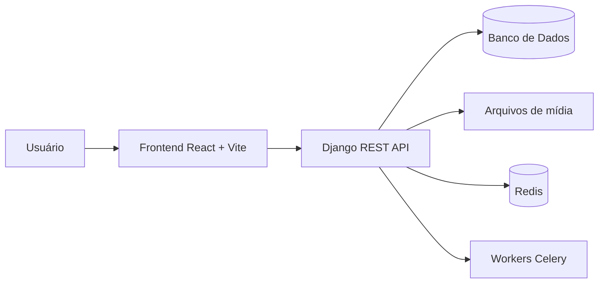

### 2. Diagrama de componentes

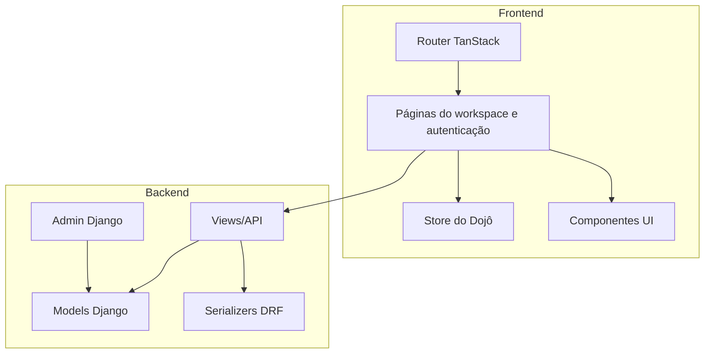

### 3. Diagrama de pacotes

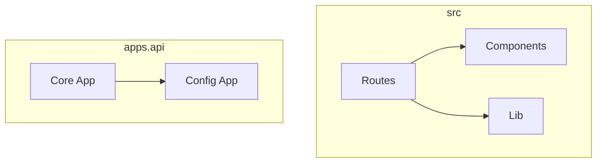

### 4. Diagrama de classes

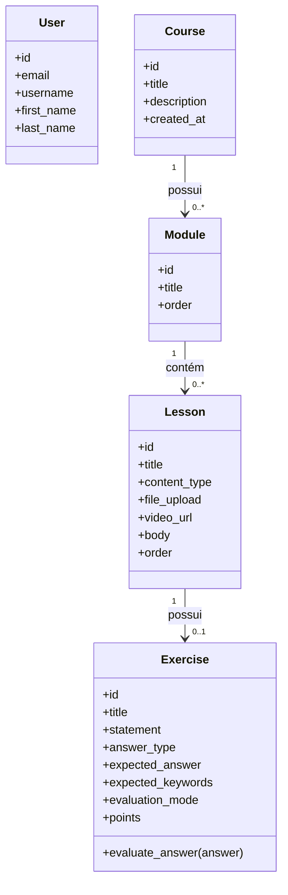

### 5. Diagrama de implantação

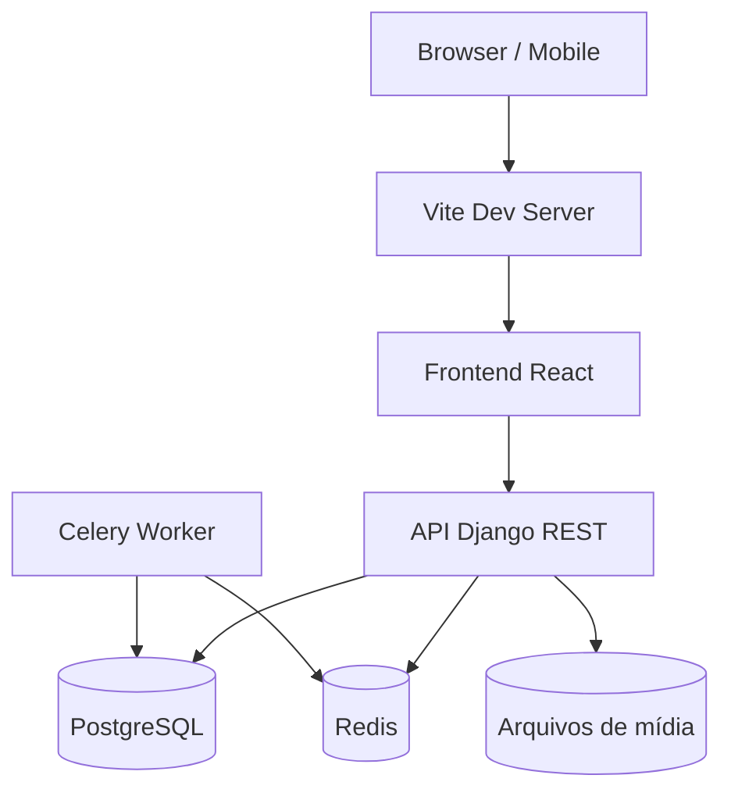

### 6. Diagrama de objetos

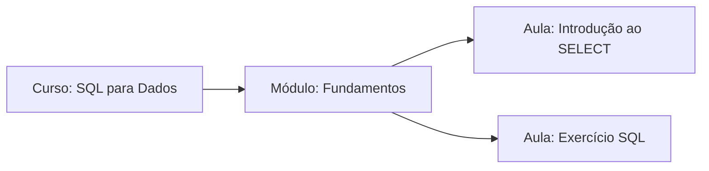

### 7. Diagrama de casos de uso

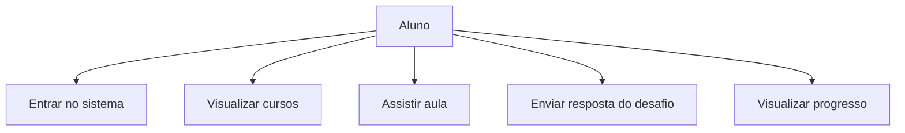

### 8. Diagrama de sequência

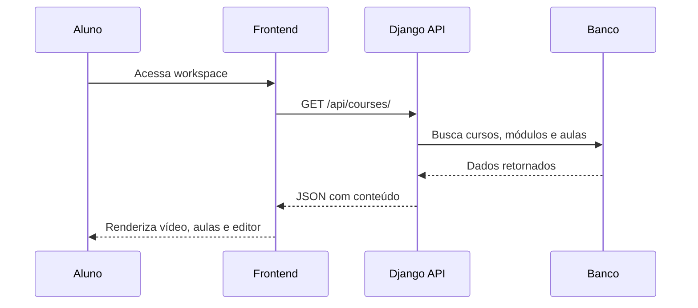

### 9. Diagrama de atividades

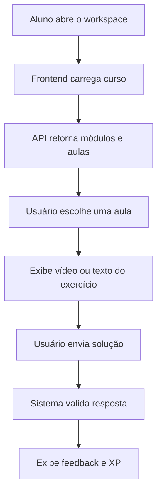

### 10. Diagrama de máquina de estados

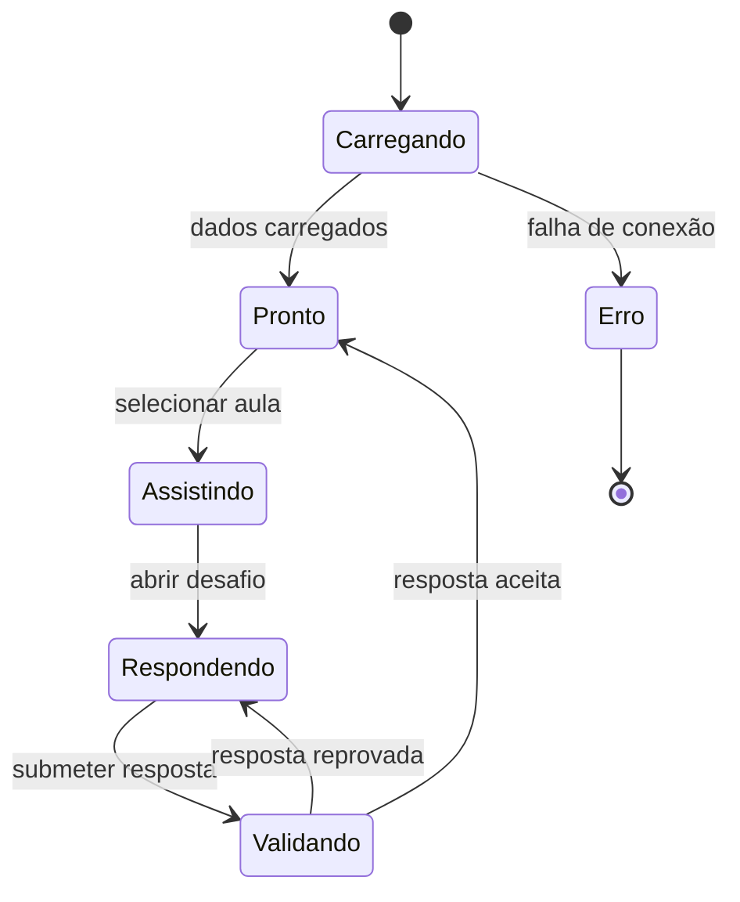

### 11. Diagrama de entidade-relacionamento (DER)

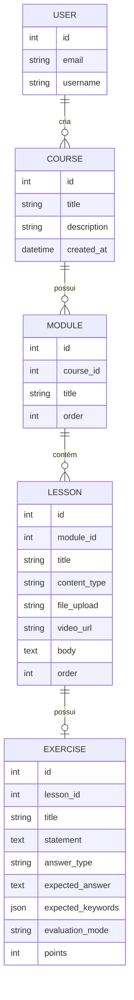

### 12. Diagrama de fluxo de dados (DFD)

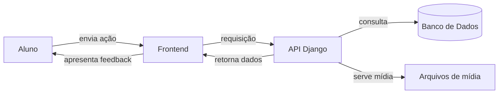

### 13. Visão de fluxo de conteúdo do curso

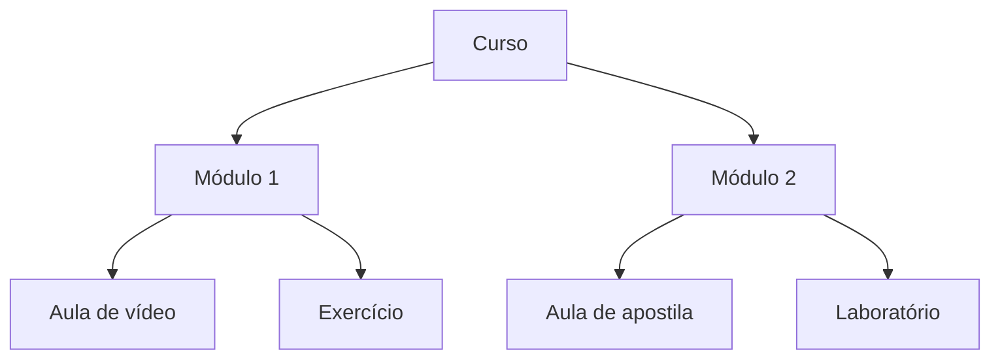

## Correções Aplicadas

- Corrigido toggle de curtidas em [src/routes/community.tsx](src/routes/community.tsx), garantindo atualização correta de estado e contagem.
- Ajustado `beforeLoad` em [src/routes/index.tsx](src/routes/index.tsx) para evitar acesso a `localStorage` durante SSR.
- Adicionado `TokenAuthentication` nas configurações do Django para compatibilidade com `dj-rest-auth`.
- Permitido CORS para `http://localhost:5173` e `http://127.0.0.1:5173` no backend.

## Configuração Local

### Frontend

1. Instale dependências:
   ```bash
    npm install
   ```
2. Inicie o frontend:
   ```bash
   npm run dev
   ```
3. Abra em `http://localhost:5173`

### Backend

1. Acesse o backend:
   ```bash
   cd apps/api
   ```
2. Crie e ative um ambiente virtual:
   ```bash
   python -m venv .venv
   .venv\Scripts\activate
   ```
3. Instale dependências:
   ```bash
   pip install -r requirements.txt
   ```
4. Execute migrações:
   ```bash
   python manage.py migrate
   ```
5. Inicie o servidor:
   ```bash
   python manage.py runserver
   ```

### Banco de Dados

- O backend usa PostgreSQL por padrão com configuração em [apps/api/config/settings.py](apps/api/config/settings.py).
- Para usar SQLite local, defina `DJANGO_USE_SQLITE=True` nas variáveis de ambiente.

## Endpoints Principais

- `GET /api/courses/`
- `GET /api/modules/`
- `GET /api/lessons/`
- `POST /api/auth/login/`
- `POST /api/auth/registration/`

## Scripts Úteis

- `npm run dev` — iniciar frontend em desenvolvimento
- `npm run build` — gerar build de produção
- `npm run preview` — visualizar build
- `npm run lint` — executar ESLint

## Uso

1. Inicie o backend Django.
2. Inicie o frontend Vite.
3. Acesse `http://localhost:5173`.

## Observações

- O workspace carrega o primeiro curso disponível e usa validação simples de SQL para aprovação de desafios.
- O feed comunitário é alimentado por posts seed e permite curtidas locais.
- A autenticação é baseada em token gravado no `localStorage`.
- A autenticação é baseada em token gravado no `localStorage`.

---

**.gitignore — documentação e boas práticas**

Objetivo

- Fornecer orientação clara sobre o propósito de `/.gitignore` e as categorias de arquivos que não devem ser versionadas.

Por que manter um `.gitignore` bem escrito

- Protege segredos e credenciais (ex.: arquivos `.env`).
- Evita incluir dependências e artefatos binários que incham o repositório.
- Reduz o risco de conflitos e commits acidentais de arquivos gerados localmente.

Categorias recomendadas

- Dependências e builds: `node_modules/`, `.output/`, `dist/`, `build/`
- Ambientes e caches: `.venv/`, `venv/`, `__pycache__/`, `.pytest_cache/`
- Dados locais e uploads: `db.sqlite3`, `media/`, `uploads/`
- Arquivos sensíveis: `.env`, `.env.local`, `credentials.json`
- Ferramentas/IDE: `.vscode/`, `.idea/`, `.DS_Store`, `Thumbs.db`
- Logs e relatórios: `npm-debug.log`, `yarn-debug.log`, `coverage/`

Trecho de exemplo (recomenda-se revisar para o seu contexto)

```
# Node / frontend
node_modules/
.output/

# Python / Django
.venv/
venv/
db.sqlite3
media/

# Ambiente local / Segredos
.env

# IDEs / OS
.vscode/
.DS_Store
```

Como remover um arquivo já comitado por engano

1. Remova do índice, mantendo-o no disco:

   git rm --cached path/to/file
2. Commit e push:

   git commit -m "chore: remover arquivo sensível do repositório"
   git push

Manutenção

- Atualize o arquivo quando adicionar novas ferramentas/fluxos de build.
- Use templates oficiais do GitHub como base: https://github.com/github/gitignore
