# 🏗️ Data Driven Dojô — Arquitetura e Diagramas

> Documento técnico complementar ao README. Mantém os diagramas originais do projeto e adiciona a arquitetura-alvo da evolução do Dojô.

---

## 1. Arquitetura-alvo — visão estratégica

A nova arquitetura mantém a separação entre experiência, aplicação, dados e processamento assíncrono, preparando o Dojô para crescer sem perder simplicidade.

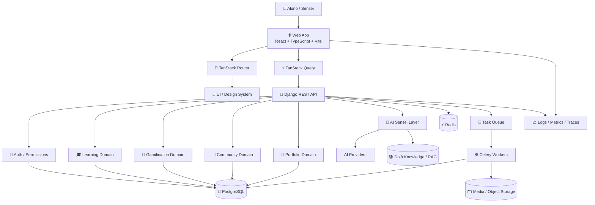

### Camadas da arquitetura-alvo

| Camada | Responsabilidade | Tecnologias principais |
|---|---|---|
| Experience | Interface, navegação e UX | React, TypeScript, Vite |
| Routing & Data | Rotas, cache e sincronização | TanStack Router, TanStack Query |
| Application | Regras e APIs | Django, DRF |
| Domains | Aprendizagem, gamificação, comunidade, portfólio | Django Apps |
| AI | Mentoria, feedback e personalização | AI providers + RAG |
| Data | Persistência transacional | PostgreSQL |
| Cache/Queue | Performance e tarefas assíncronas | Redis + Celery |
| Storage | Vídeos, arquivos e mídia | Object Storage |
| Observability | Saúde técnica e produto | Logs, métricas e traces |

---

## 2. Arquitetura de domínio

A evolução deve separar o backend por **domínios de negócio**, evitando concentrar toda a lógica em uma única aplicação Django.

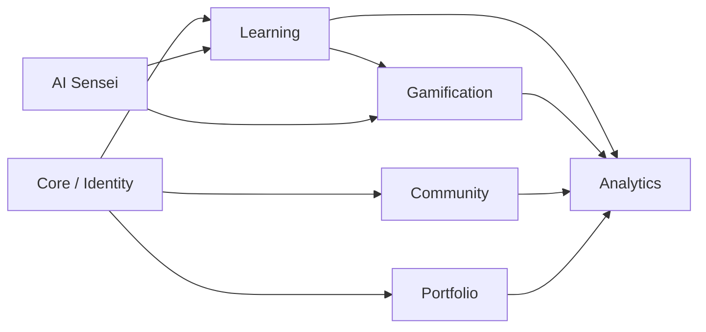

### Responsabilidades

- **Identity/Core:** usuário, autenticação, permissões e perfil-base.
- **Learning:** cursos, trilhas, módulos, aulas e exercícios.
- **Gamification:** XP, faixas, badges, streak e conquistas.
- **Community:** posts, comentários, curtidas e interação.
- **Portfolio:** projetos, evidências e apresentação profissional.
- **AI Sensei:** recomendações, feedback e mentoria contextual.
- **Analytics:** eventos de aprendizagem e indicadores de produto.

---

## 3. Fluxo principal do aluno

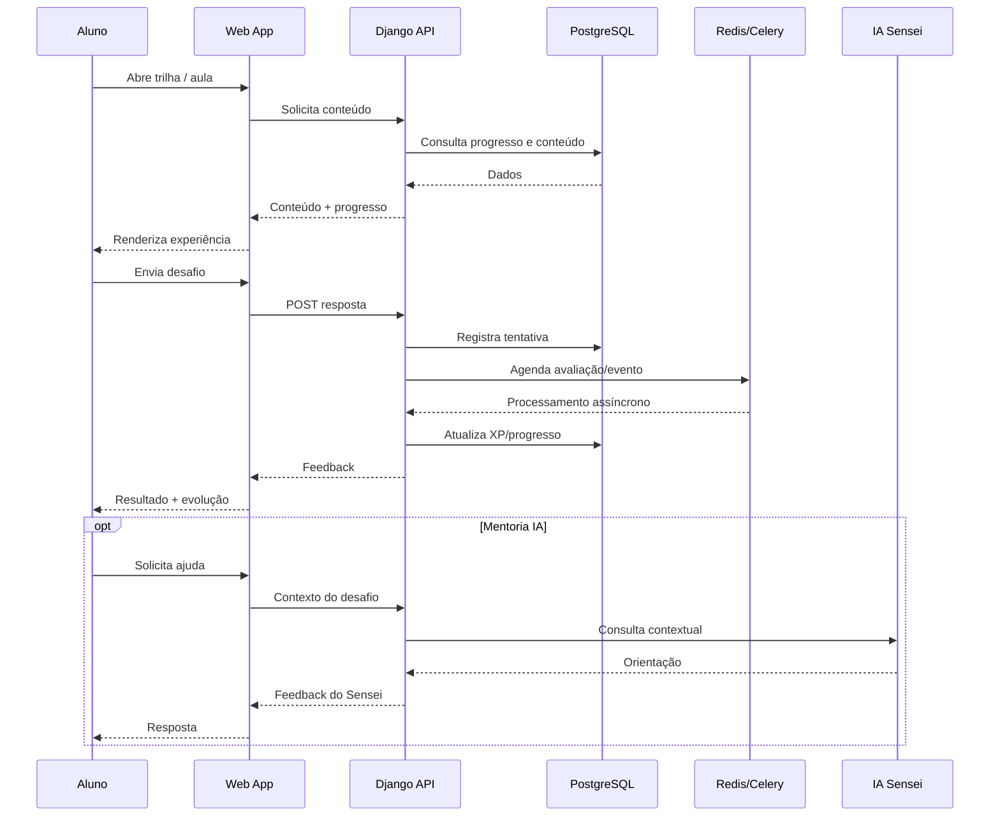

---

## 4. Arquitetura de frontend

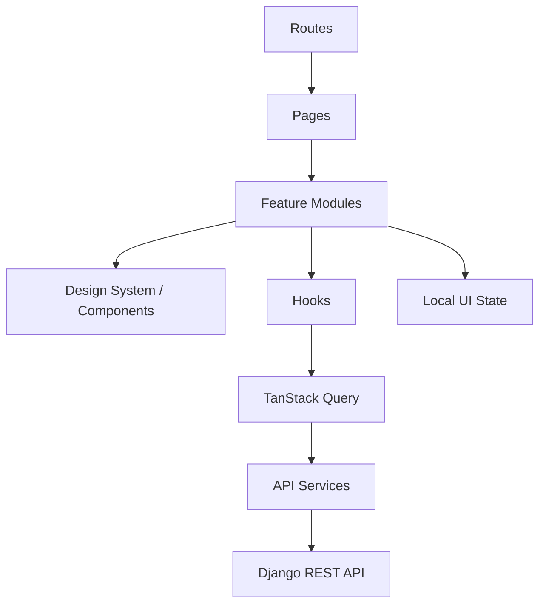

### Regra de organização

```text
routes/
   ↓
pages/
   ↓
features/
   ↓
components/
   ↓
hooks + services + query
```

O objetivo é evitar páginas gigantes e permitir evolução independente de cada área do produto.

---

## 5. Arquitetura de dados

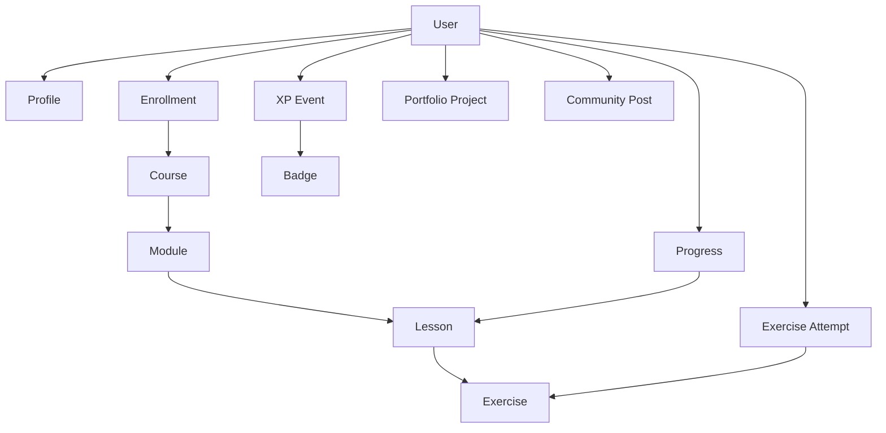

---

# Diagramas originais preservados

Os diagramas abaixo foram mantidos para preservar a documentação histórica e técnica da primeira arquitetura do projeto.

## 6. Diagrama estrutural / arquitetura de alto nível

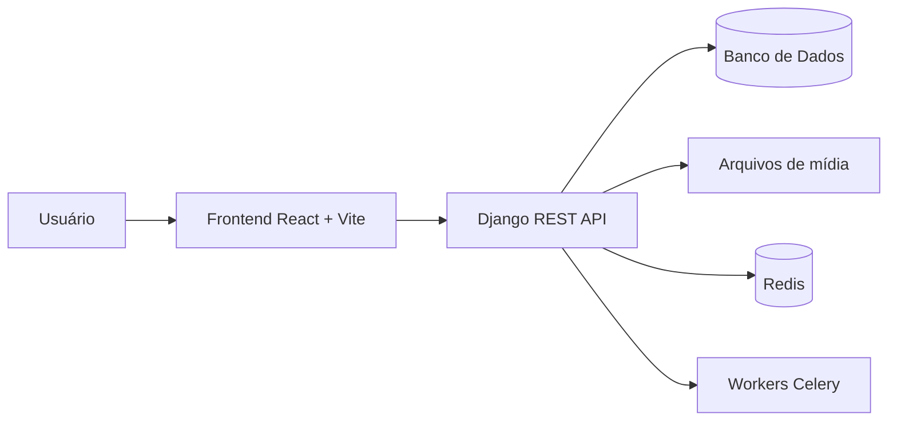

## 7. Diagrama de componentes

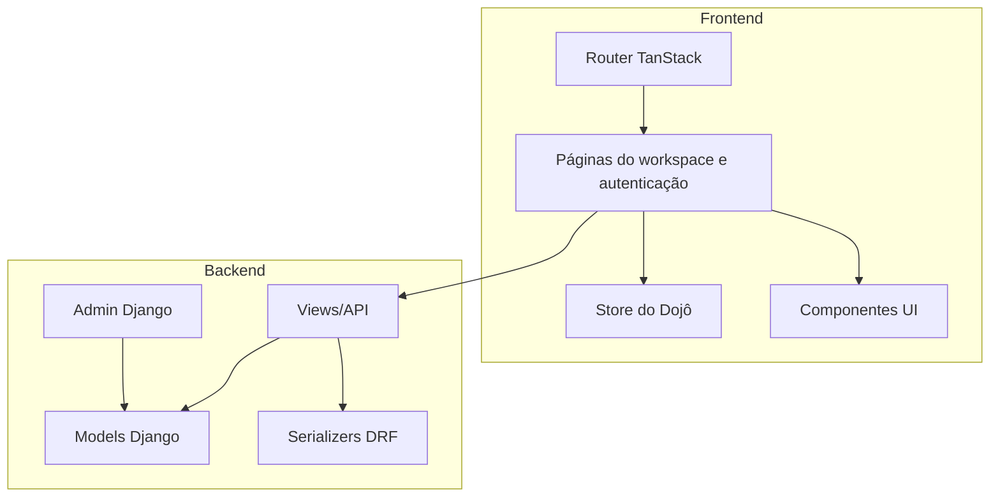

## 8. Diagrama de pacotes

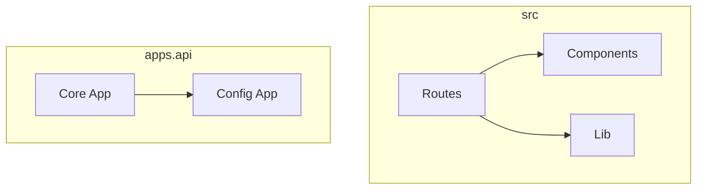

## 9. Diagrama de classes

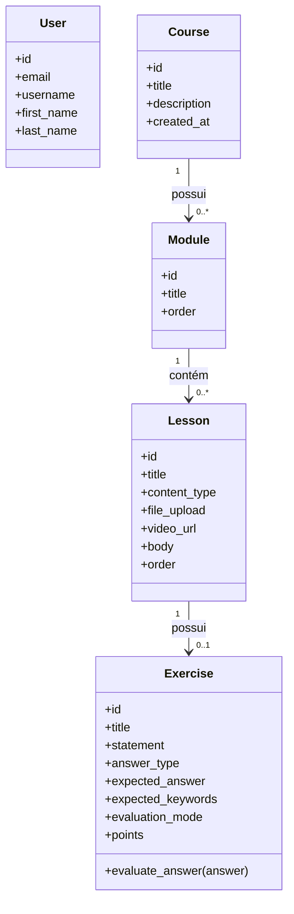

## 10. Diagrama de implantação

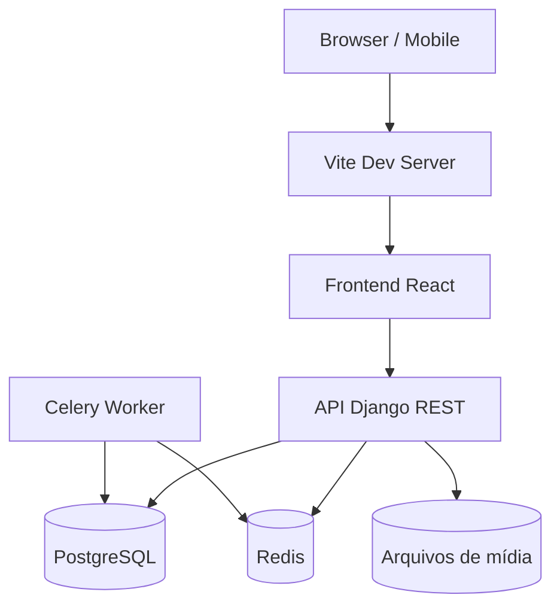

## 11. Diagrama de objetos

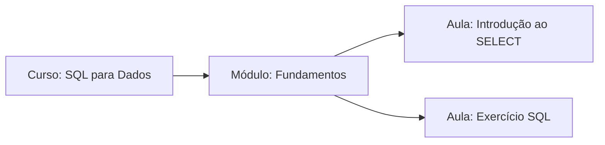

## 12. Diagrama de casos de uso

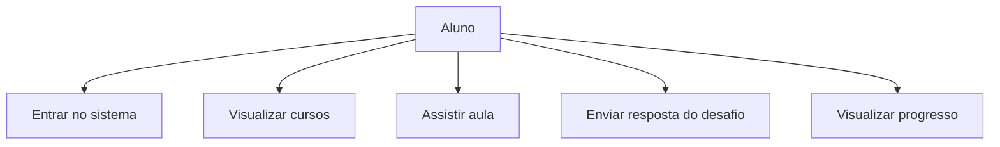

## 13. Diagrama de sequência original

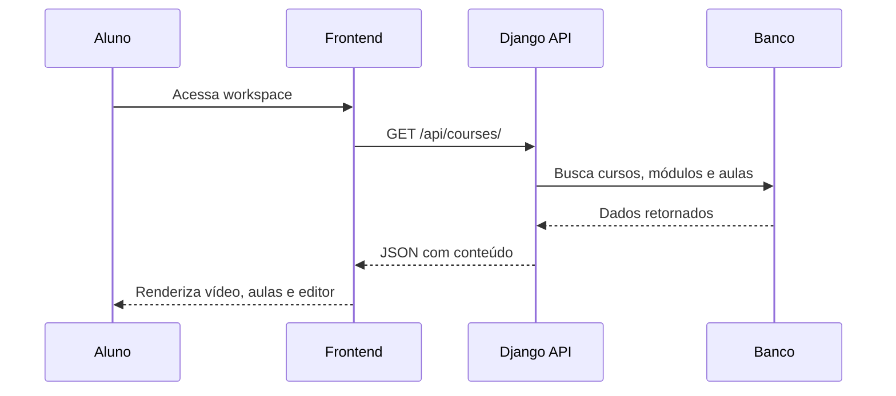

## 14. Diagrama de atividades

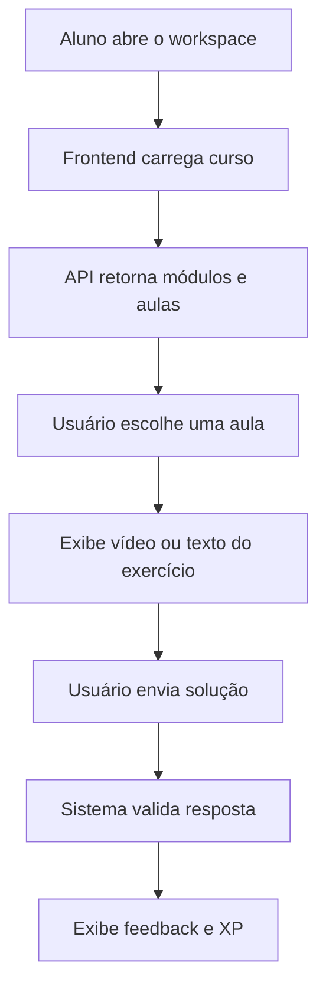

## 15. Diagrama de máquina de estados

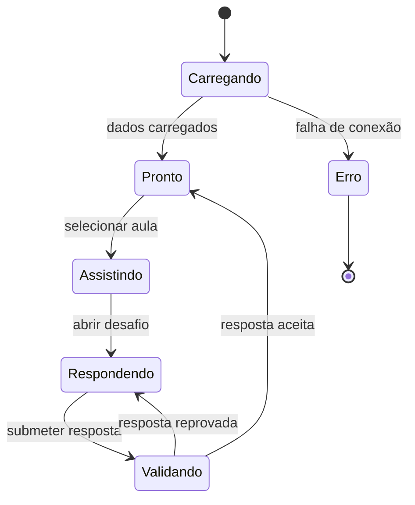

## 16. Diagrama de entidade-relacionamento — DER original

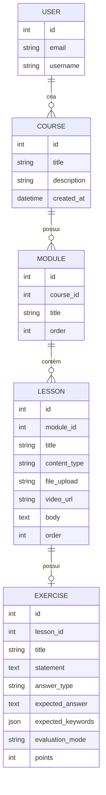

## 17. Diagrama de fluxo de dados — DFD original

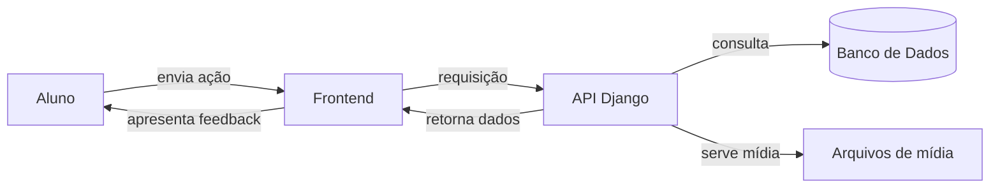

## 18. Visão de fluxo de conteúdo do curso

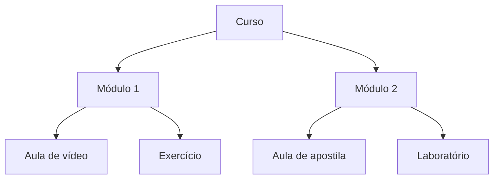

---

## 19. Matriz de evolução arquitetural

| Área | Arquitetura original | Arquitetura-alvo |
|---|---|---|
| Frontend | React/Vite | React/Vite + features + design system |
| Dados do frontend | Store/local | TanStack Query + estado local por responsabilidade |
| Backend | Core Django centralizado | Domínios Django separados |
| Aprendizagem | Course/Module/Lesson | Learning + Progress + Assessment |
| Gamificação | XP/progresso | Gamification domain + eventos |
| Comunidade | Feed | Community domain |
| Portfólio | Interface | Portfolio domain + evidências |
| IA | Evolução futura | AI Sensei + RAG + serviços especializados |
| Tarefas | Celery/Redis | Jobs assíncronos orientados a eventos |
| Arquivos | Media local | Storage desacoplado |
| Observabilidade | Básica | Logs + métricas + traces |
| Escala | Monólito modular | Monólito modular preparado para serviços quando necessário |

> **Princípio:** não transformar o Dojô em microserviços prematuramente. Primeiro modularizar o monólito, medir o comportamento e extrair serviços apenas quando houver uma necessidade real de escala, isolamento ou domínio.

---

## 20. Direção arquitetural

```text
                 🥋 DATA DRIVEN DOJÔ
                          │
          ┌───────────────┼────────────────┐
          │               │                │
       EXPERIENCE      LEARNING         COMMUNITY
          │               │                │
          └───────────────┼────────────────┘
                          │
                    APPLICATION
                          │
          ┌───────────────┼────────────────┐
          │               │                │
        DATA        GAMIFICATION          AI
          │               │                │
          └───────────────┼────────────────┘
                          │
                  PLATFORM SERVICES
                          │
       ┌──────────────────┼──────────────────┐
       │                  │                  │
    PostgreSQL          Redis             Celery
       │                  │                  │
       └──────────────────┼──────────────────┘
                          │
                 OBSERVABILITY / CLOUD
```

### Regra de ouro

**Evoluir a arquitetura na mesma velocidade que o produto.**

O objetivo não é ter a arquitetura mais complexa. É ter a arquitetura **mais adequada ao estágio do Dojô**, permitindo que a plataforma cresça com qualidade, performance, segurança e previsibilidade.
