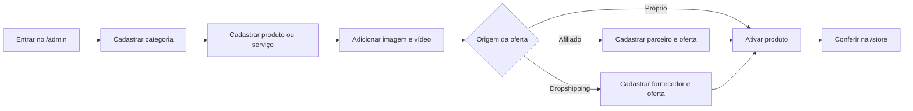
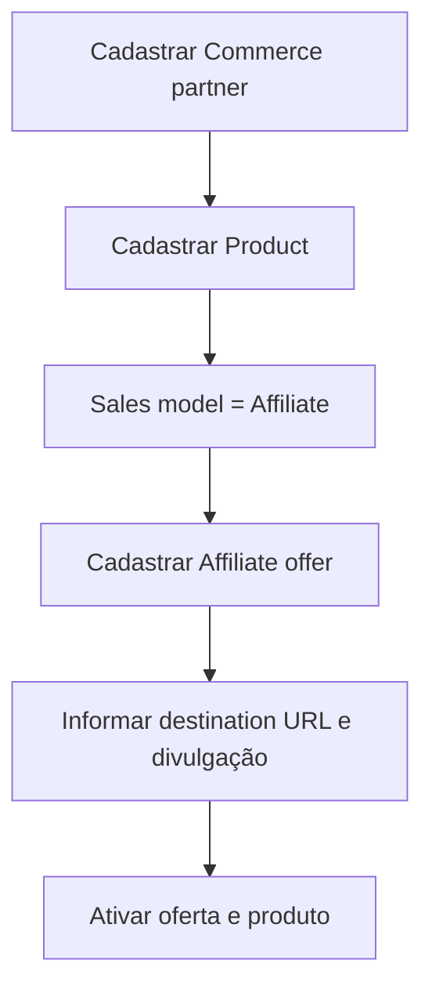
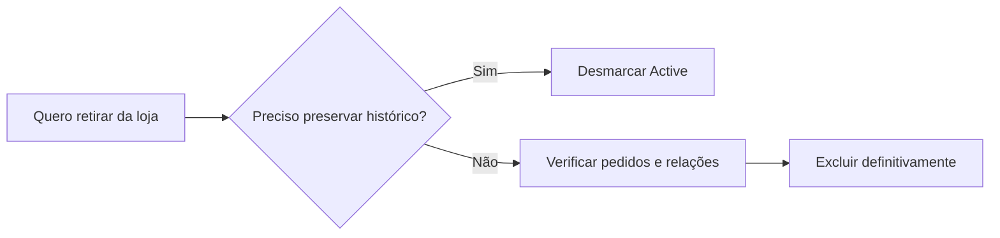

# Manual da 3DStore: produtos e serviços

Este manual explica como cadastrar, publicar, editar, desativar e remover itens da 3DStore pelo Django Admin, incluindo imagens e vídeos.

Para instalar e executar todo o ecossistema no computador, consulte o [Manual do sistema local](manual_sistema_local.md).

## 1. Acessos

- Produção: `https://data-dojo.onrender.com/admin/`
- Loja: `https://data-dojo-nine.vercel.app/store`
- Local: `http://127.0.0.1:8000/admin/`

Use uma conta administrativa. Se ainda não existir, abra o **Shell** do serviço no Render e execute:

```bash
python manage.py createsuperuser
```

Nunca compartilhe senha administrativa, `DATABASE_URL` ou outros Secrets.

## 2. Visão geral ilustrada



No painel, a estrutura principal será semelhante a:

```text
ADMINISTRAÇÃO DA LOJA
├─ Categories                 → categorias do catálogo
├─ Products                   → produtos e serviços
├─ Commerce partners          → afiliados e fornecedores
├─ Affiliate offers           → links de produtos afiliados
├─ Dropship offers            → dados de dropshipping
├─ Product questions          → perguntas dos clientes
└─ Product reviews            → avaliações
```

## 3. Cadastrar uma categoria

1. Acesse **Store → Categories → Add category**.
2. Preencha **Name**, por exemplo `Cursos e Formações`.
3. O **Slug** será preenchido como `cursos-e-formacoes`.
4. Escreva uma descrição curta.
5. Marque **Active**.
6. Clique em **Save**.

Categorias sugeridas: cursos, mentorias, livros e e-books, templates, software e ferramentas, equipamentos, serviços de dados, marketing digital e produtos de parceiros.

## 4. Cadastrar produto ou serviço

Acesse **Store → Products → Add product**.

```text
┌─ IDENTIFICAÇÃO ─────────────────────────────────────┐
│ Name: Kit de Dashboard para Analytics              │
│ Slug: kit-dashboard-analytics                      │
│ Category: Templates                                │
│ Short description: resumo exibido no catálogo     │
│ Description: explicação completa                 │
├─ OFERTA ───────────────────────────────────────────┤
│ Product type: Digital | Physical | Service         │
│ Sales model: Own | Affiliate | Dropshipping        │
│ Price / Compare at price / Stock                   │
├─ MÍDIA ────────────────────────────────────────────┤
│ Image | Image URL | Image preview | Video URL      │
├─ PUBLICAÇÃO ─────────────────────────────────────┤
│ Active | Featured                                  │
└────────────────────────────────────────────────────┘
```

### Tipos

| Situação | Product type | Estoque |
|---|---|---:|
| E-book, template ou curso | Digital | pode ficar `0` |
| Equipamento ou livro físico | Physical | quantidade real disponível |
| Mentoria, consultoria ou tráfego pago | Service | pode ficar `0` |

### Modelos de venda

| Situação | Sales model |
|---|---|
| Produto/serviço da 3DS | Own |
| Indicação com comissão | Affiliate |
| Fornecedor envia ao cliente | Dropshipping |

Preencha preço, descrição e categoria. Marque **Active** somente quando o item estiver pronto para aparecer na loja. **Featured** faz o item ganhar prioridade no catálogo.

## 5. Inserir imagem

Existem duas alternativas:

1. **Image**: envie JPG, JPEG, PNG ou WebP de até 5 MB.
2. **Image URL**: informe uma URL pública HTTPS, como a de um CDN ou storage.

Se ambas forem preenchidas, o upload em **Image** tem prioridade. A prévia aparece em **Image preview**.

> Em instâncias gratuitas do Render, arquivos locais podem desaparecer em reinicializações ou novos deploys. Em produção, prefira **Image URL** hospedada em Cloudinary, Amazon S3, Supabase Storage ou serviço equivalente.

Recomendação: imagem WebP em proporção 16:9, pelo menos 1200 × 675 px, fundo limpo e sem texto pequeno.

## 6. Inserir vídeo

No campo **Video URL**, cole uma URL pública:

- YouTube: `https://www.youtube.com/watch?v=...`
- YouTube curto: `https://youtu.be/...`
- Vimeo: `https://vimeo.com/...`
- Arquivo direto: URL terminada em `.mp4`, `.webm` ou `.ogg`

YouTube e Vimeo aparecem incorporados no cartão. Arquivos diretos usam o player nativo. Outras URLs aparecem como **Assistir ao vídeo** e abrem em nova aba.

## 7. Produto afiliado



1. Cadastre a empresa em **Commerce partners**.
2. Cadastre o produto com **Sales model = Affiliate**.
3. Abra **Affiliate offers → Add**.
4. Selecione produto e parceiro.
5. Cole o link de afiliado em **Destination URL**.
6. Preencha comissão, janela de cookie e aviso de transparência.
7. Marque a oferta e o produto como ativos.

O produto afiliado não entra no carrinho; o botão leva ao parceiro e registra o clique.

## 8. Produto de dropshipping

1. Cadastre o fornecedor em **Commerce partners** com tipo `Supplier`.
2. Cadastre o produto físico com **Sales model = Dropshipping**.
3. Informe o estoque disponível.
4. Abra **Dropship offers → Add**.
5. Preencha SKU, custo do fornecedor, prazo de preparação, origem e URL do produto.
6. Ative produto e oferta.

O pedido entra no carrinho da 3DStore e gera um registro de atendimento do fornecedor.

## 9. Editar, ocultar e remover

Para editar, abra **Products**, clique no nome, altere os campos e salve.

Para retirar temporariamente da loja, desmarque **Active**. Essa é a opção recomendada porque preserva pedidos, avaliações e indicadores.

Para excluir definitivamente:

1. Abra o produto.
2. Clique em **Delete**.
3. Leia a lista de registros relacionados.
4. Confirme somente se não precisar mais do histórico.



Produtos presentes em pedidos podem ter exclusão bloqueada para proteger o histórico financeiro. Nesse caso, desative-os.

## 10. Checklist de publicação

- [ ] Categoria ativa
- [ ] Nome e slug sem duplicidade
- [ ] Descrição revisada
- [ ] Tipo e modelo de venda corretos
- [ ] Preço conferido
- [ ] Estoque preenchido para item físico
- [ ] Imagem carregando
- [ ] Vídeo abrindo
- [ ] Oferta afiliada/dropshipping ativa, quando aplicável
- [ ] Produto marcado como **Active**
- [ ] Teste realizado na 3DStore em computador e celular

## 11. Perguntas e avaliações

Perguntas aparecem em **Product questions**. Abra a pergunta, escreva a resposta e salve. Avaliações podem ser consultadas em **Product reviews**. Remova apenas conteúdo impróprio ou que viole as regras da comunidade.

## 12. Solução de problemas

| Problema | Verificação |
|---|---|
| Produto não aparece | categoria e produto precisam estar ativos |
| Imagem não aparece | URL deve ser pública HTTPS; confirme permissões do storage |
| Upload sumiu após deploy | use storage persistente e cadastre a URL pública |
| Vídeo não incorpora | confirme URL do YouTube/Vimeo ou use link direto MP4/WebM |
| Item físico está esgotado | atualize **Stock** para valor maior que zero |
| Afiliado entra no carrinho | confira se **Sales model** está como `Affiliate` |
| Exclusão foi bloqueada | desative o produto para preservar pedidos relacionados |
